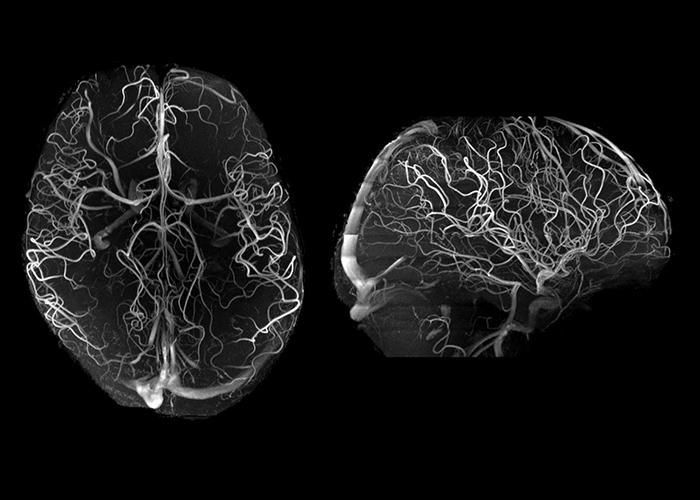

# Generating synthetic CT scans from MRIs to enhance radiotherapy tretement planning

## About me

<a href="https://github.com/KhaledAshkar">
   
    <b>Khaled Ashkar</b>
</a>

nanana
## Project summary
This project aims to develop a deep learning model that generates reliable synthetic CT scans from MRIs only, Contrast and Field magnitude-agnostic to eliminate the need for additional CT scans in hospitals and clinics.
#### Keywords
##### MRI, CT, CBCT, Radiotherapy, Treatement planning

### Background 
Over the past decades, medical imaging has significantly enhanced the diagnosis and treatment of oncological patients, particularly in radiotherapy (RT). Traditionally, 3D computed tomography (CT) is the primary imaging modality used in RT for accurate patient geometry, dose calculations, and plan optimization. However, CT exposes patients to ionizing radiation, which is a concern, especially for repeated simulations or vulnerable populations such as pediatric patients. Magnetic resonance imaging (MRI), with its superior soft-tissue contrast, has proven valuable for tumor and organ-at-risk delineation, patient positioning, and monitoring. Despite its advantages, MRI lacks the necessary tissue attenuation information required for accurate dose calculations, making CT still necessary in RT workflows. To overcome these challenges, recent advancements have focused on generating synthetic CT (sCT) images from MRIs. This approach aims to combine the superior imaging capabilities of MRI with the essential dose calculation information of CT, reducing the patient's exposure to radiation and simplifying the workflow. Artificial intelligence (AI) techniques, particularly machine learning and deep learning, have emerged as leading methods for creating sCT images from MRI data. These AI-driven methods have the potential to enhance the accuracy of RT planning and delivery. However, the field still faces the challenge of a lack of public datasets and standardized benchmarks to validate and compare different AI approaches. This project aims to develop and refine AI algorithms to generate high-quality CT scans from MRIs, thereby improving RT workflows and patient outcomes by leveraging the best features of both imaging modalities.

### Main Objectives

### Personal Objectives

### Tools
This project relied on numerous tools such as:

- Git and GitHub;
- High performance computing (HPC), such as Google Colab, for training the model;
- Python packages, such as matplotlib, pandas and torch.

### Data used
The dataset can be downloaded from https://doi.org/10.5281/zenodo.7260705 and a detailed description is offered at "synthRAD2023_dataset_description.pdf".
The training datasets for Task1 is in Task1.zip, while for Task2 in Task2.zip. After unzipping, each Task is organized according to the following folder structure:
Task1.zip/
├── Task1
   ├── brain
    ├── 1Bxxxx
       ├── mr.nii.gz
       ├── ct.nii.gz
       └── mask.nii.gz

Each patient folder has a unique name that contains information about the task, anatomy, center and a patient ID. The naming follows the convention below:
[Task]    [Anatomy]    [Center]    [PatientID]
   1          B            A           001
In each patient folder, three files can be found: 
ct.nii.gz: CT image 
mr.nii.gz or cbct.nii.gz (depending on the task): CBCT/MR image
mask.nii.gz:image containing a binary mask of the dilated patient outline 
For each task and anatomy, an overview folder is provided which contains the following files:
[task]_[anatomy]_train.xlsx: This file contains information about the image acquisition protocol for each patient.
[task][anatomy][center][PatientID]_train.png: For each patient a png showing axial, coronal and sagittal slices of CBCT/MR, CT, mask and the difference between CBCT/MR and CT is provided. These images are meant to provide a quick visual overview of the data.

The data used in this project covered 30 Brain images taken with MRI and CT only. For the sake of time constraints and computational resources, the models were trained on 1, 3, 7, 10 and 20 subjects at a time to analyze the performance of each and the effect of the hyperparameters on the model convergence and results.

This challenge dataset contains imaging data of patients who underwent radiotherapy in the brain or pelvis region. Overall, the population is predominantly adult and no gender restrictions were considered during data collection. For Task 1, the inclusion criteria were the acquisition of a CT and MRI during treatment planning while for task 2, acquisitions of a CT and CBCT, used for patient positioning, were required. Datasets for task 1 and 2 do not necessarily contain the same patients, given the different image acquisitions for the different tasks.
Data was collected at 3 Dutch university medical centers:

-Radboud University Medical Center
-University Medical Center Utrecht
-University Medical Center Groningen
For anonymization purposes, from here on, institution names are substituted with A, B and C, without specifying which institute each letter refers to.
All images were acquired with the clinically used scanners and imaging protocols of the respective centers and reflect typical images found in clinical routine. As a result, imaging protocols and scanner can vary between patients. A detailed description of the imaging protocol for each image, can be found in spreadsheets that are part of the dataset release (see dataset structure).

Data was acquired with the following scanners:
Center A:
MRI: Philips Ingenia 1.5T/3.0T
CT: Philips Brilliance Big Bore or Siemens Biograph20 PET-CT
CBCT: Elekta XVI

Center B:
MRI: Siemens MAGNETOM Aera 1.5T or MAGNETOM Avanto_fit 1.5T
CT: Siemens SOMATOM Definition AS
CBCT: IBA Proteus+ or Elekta XVI

Center C:
MRI: Siemens Avanto fit 1.5T or Siemens MAGNETOM Vida fit 3.0T
CT: Philips Brilliance Big Bore
CBCT: Elekta XVI

For task 1, MRIs were acquired with a T1-weighted gradient echo or an inversion prepared - turbo field echo (TFE) sequence and collected along with the corresponding planning CTs for all subjects. The exact acquisition parameters vary between patients and centers. For centers B and C, selected MRIs were acquired with Gadolinium contrast, while the selected MRIs of center A were acquired without contrast.
For task 2, the CBCTs used for image-guided radiotherapy ensuring accurate patient position were selected for all subjects along with the corresponding planning CT.
The following pre-processing steps were performed on the data:
Conversion from dicom to compressed nifti (nii.gz)
Rigid registration between CT and MR/CBCT
Anonymization (face removal, only for brain patients)
Patient outline segmentation (provided as a binary mask)
Crop MR/CBCT, CT and mask to remove background and reduce file sizes
The code used to preprocess the images can be found at: https://github.com/SynthRAD2023/. Detailed information about the dataset are provided in SynthRAD2023_dataset_description.pdf published here along with the data and will also be submitted to Medical Physics.

### Project Delivrables
- Github reposiory with all the data needed to train the model, describing the project and explaining the results;
- Two Pre-trained models on 3 and 7 Brain images;
- The Wrap-up presentation done at the end of the Brainhack school (14-06-2024);
- Two versions of the model (ready to be ran on Google Colab for faster computing and locally using a CPU only).

## Results

### Preprocessing 
The MRI data used to train the model had different sizes, meanwhile the model takes (128x128) arrays. The first step was to padd all the images with 50 to 100 pixels ( MRI,CT and the mask) to ensure a (256x256) sized array. Next, I resized the images to (128x128) to match the conditions. I could have trained the model on higher resolution but I decided to go with less due to the computational resources and do to have a model capable of delivering good results in case of degraded images.
Using "ITK-SNAP", I made sure that the images and the mask are aligned, which saved a lot of work. The mask covered all the needed area in all the images so no additional segmentation was done.

### Model Testing and Validation
After trying more than 22 combinations of subjects number, epochs number and batch size, I decided to compare 3 models:
1- 20 ep, batch size 4 and 1 subject
2- 100 ep, batch size 10 and 7 subjects
3- 200 ep, batch size 5 and 3 subjects
During the validation on the 20% of the training data that the model didn't see, all of the 3 models showed moderate to good results. But it was during the validation on external data that the model (100ep_b10_7sub) showed better performance since it was trained on more subjects. It was not clear if the effect was due to the batch size or the subjects number or both.
Also, the evaluation between the original CT scan and the generated one was based on the : 
- Mean absolute error (MAE)
- Peak signal to noise ratio (PSNR)
- Structrual similarity index (SSIM)

caption before
space before 

 and after
 
 ## Conclusions and acknowledgement

 ### Can we generate reliable synthetic CT scans from MRIs?
 text

 ### Objectives, Tools and Delivrables
text

## Guide to reproducibility

## References
